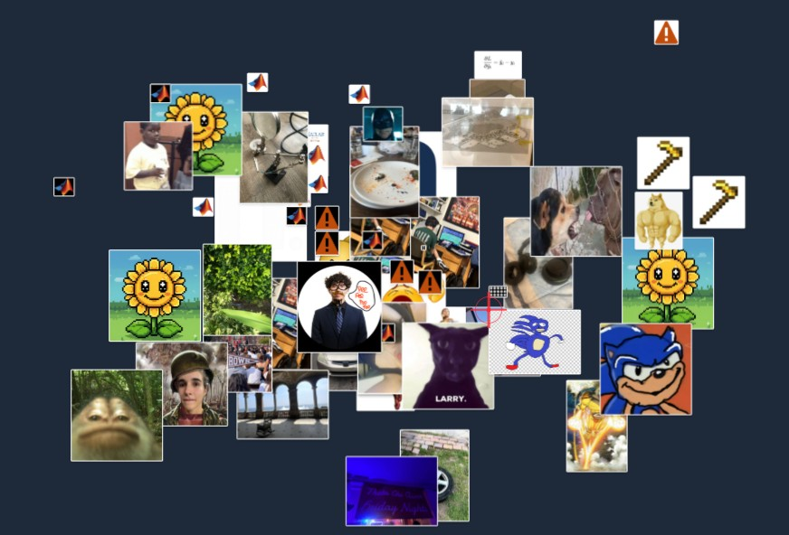

# 🎨 Anarchy Clipboard

**An infinite collaborative canvas for image sharing**

> Break free from traditional boundaries. Create, share, and explore images on an endless canvas that adapts to your creativity.



## ✨ Features

### 🌍 **Infinite Canvas**
- Navigate an endless 2D space with smooth panning and zooming
- No boundaries, no limits - truly infinite exploration
- Crosshair targeting system for precise image placement

### 🚀 **Smart Upload System**
- **Drag & drop** or **file selection** upload
- **Automatic HEIC/HEIF conversion** for iPhone photos
- **Intelligent compression** to keep images under 400KB
- **Real-time** image processing and optimization

### 🎮 **Advanced Controls**
- **D-pad movement** with velocity acceleration
- **Mouse wheel zoom** (10% - 500% scale)
- **Touch-friendly** mobile interface
- **Keyboard navigation** support

### 🤝 **Collaborative Features**
- **Anonymous collaboration** - no registration required
- **Real-time updates** - see others' uploads instantly
- **Live synchronization** across all connected users
- **Community moderation** for respectful sharing

### 📱 **Mobile Optimized**
- Responsive design for all screen sizes
- Touch controls with proper event handling
- Mobile-first approach with desktop enhancements

## 🛠️ Tech Stack

- **Frontend**: Next.js 13+ (App Router)
- **Styling**: Tailwind CSS
- **Backend**: Appwrite (Database + Storage)
- **Image Processing**: HTML5 Canvas + heic2any
- **Real-time**: Appwrite Realtime subscriptions
- **Deployment**: Vercel-ready

## 📋 Important Information

### Image Management
- **Maximum 100 images** total on the canvas
- When limit is reached, **oldest images are automatically deleted**
- Images larger than 400KB are **automatically compressed**
- **HEIC/HEIF support** with automatic conversion

### Community Guidelines
- **Anyone can upload anything**, but content will be moderated
- **Be respectful** and follow community standards
- Perfect for memes, promos, advertisements, shoutouts, art, photography

### Canvas Etiquette
- Canvas is **truly infinite**, but please **stay near center (0,0)**
- This keeps the community together and content discoverable
- Use the coordinate display to navigate back to populated areas

## 🚀 Getting Started

### Prerequisites
- Node.js 18+ 
- npm/yarn/pnpm
- Appwrite account and project setup

### Installation

1. **Clone the repository**
```bash
git clone https://github.com/brubru6707/anarchy_clipboard.git
cd anarchy_clipboard
```

2. **Install dependencies**
```bash
npm install
# or
yarn install
# or
pnpm install
```

3. **Environment Setup**
Create a `.env.local` file in the root directory:
```env
NEXT_PUBLIC_APPWRITE_ENDPOINT=your_appwrite_endpoint
NEXT_PUBLIC_APPWRITE_PROJECT_ID=your_project_id
NEXT_PUBLIC_DATABASE_ID=your_database_id
NEXT_PUBLIC_IMAGE_COLLECTION_ID=your_collection_id
NEXT_PUBLIC_IMAGE_BUCKET_ID=your_bucket_id
```

4. **Run the development server**
```bash
npm run dev
# or
yarn dev
# or
pnpm dev
```

5. **Open your browser**
Navigate to [http://localhost:3000](http://localhost:3000)

## ⚙️ Appwrite Configuration

### Database Schema
Create a collection with these attributes:
- `userId` (string) - User identifier
- `fileId` (string) - Appwrite file ID
- `x` (integer) - X coordinate on canvas
- `y` (integer) - Y coordinate on canvas

### Storage Bucket
- Configure for image files
- Set appropriate size limits (recommended: 5MB max)
- Enable public read permissions

### Permissions
```javascript
// Collection permissions
Permission.read(Role.any())
Permission.create(Role.any())
Permission.update(Role.any())
Permission.delete(Role.any())

// File permissions (same as above)
```

## 🎮 Controls & Navigation

### Desktop
- **Mouse drag**: Pan around the canvas
- **Mouse wheel**: Zoom in/out (10%-500%)
- **D-pad buttons**: Directional movement with acceleration
- **File upload**: Drag & drop or click "Choose Image"

### Mobile
- **Touch drag**: Pan around the canvas
- **Pinch zoom**: Zoom in/out
- **D-pad**: Touch controls for movement
- **File upload**: Tap "Choose Image" button

### Keyboard Shortcuts
- **Arrow keys**: Move around (when D-pad has focus)
- **Space**: Reset to center (0,0)
- **R**: Reset zoom to 100%

## 📁 Project Structure

```
anarchy_clipboard/
├── app/
│   ├── clipboard/
│   │   └── page.js          # Main clipboard application
│   ├── layout.js            # Root layout
│   ├── page.js              # Landing page
│   ├── appwrite.js          # Appwrite configuration
│   └── globals.css          # Global styles
├── public/
│   ├── images/
│   │   └── anarchy_image.jpg # Project showcase image
│   └── *.svg                # Icons and graphics
├── README.md
└── package.json
```

## 🔧 Key Components

### Canvas System
- **Infinite scrolling** with transform-based positioning
- **Zoom controls** with CSS scale transforms
- **Image rendering** with absolute positioning
- **Crosshair targeting** for precise placement

### Upload Pipeline
1. File selection/drag & drop
2. HEIC conversion (if needed)
3. Canvas-based compression
4. Appwrite storage upload
5. Database record creation
6. Real-time synchronization

### Movement System
- **Velocity-based acceleration** for smooth movement
- **Boundary protection** with maximum pan values
- **Touch and mouse** event handling
- **Visual feedback** with active states

## 🌟 Tips for Users

- **Stay near center**: The canvas is infinite, but the community gathers around (0,0)
- **Use compression wisely**: Large images are auto-compressed, but smaller files load faster
- **Explore the space**: Use coordinates to navigate to specific areas
- **Be creative**: Perfect for memes, art, promotions, or any visual content
- **Respect others**: Content is moderated, so keep it community-friendly

## 🚢 Deployment

### Vercel (Recommended)
1. Connect your GitHub repository to Vercel
2. Add environment variables in Vercel dashboard
3. Deploy automatically on commits

### Environment Variables
Ensure all `NEXT_PUBLIC_*` variables are properly set in your deployment platform.

## 🤝 Contributing

1. Fork the repository
2. Create a feature branch (`git checkout -b feature/amazing-feature`)
3. Commit your changes (`git commit -m 'Add amazing feature'`)
4. Push to the branch (`git push origin feature/amazing-feature`)
5. Open a Pull Request

## 📝 License

This project is open source and available under the [MIT License](LICENSE).

## 🙏 Acknowledgments

- **Next.js** - The React framework for production
- **Appwrite** - Backend-as-a-Service platform
- **Tailwind CSS** - Utility-first CSS framework
- **heic2any** - HEIC to JPEG conversion library

---

**Built with ❤️ for the creative community**

> Have fun, be creative, and explore the infinite possibilities!
